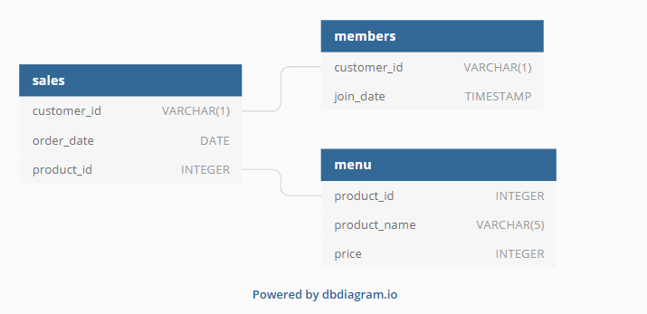
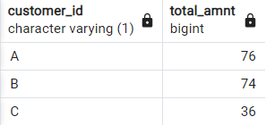
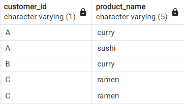
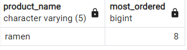
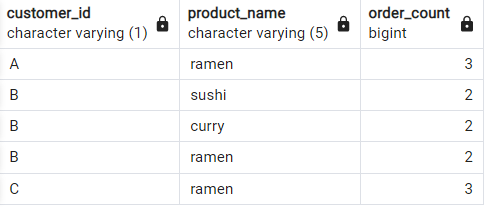
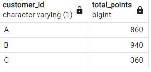
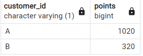
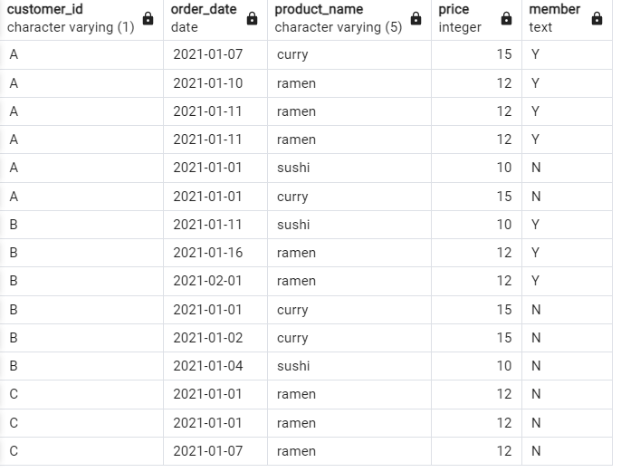
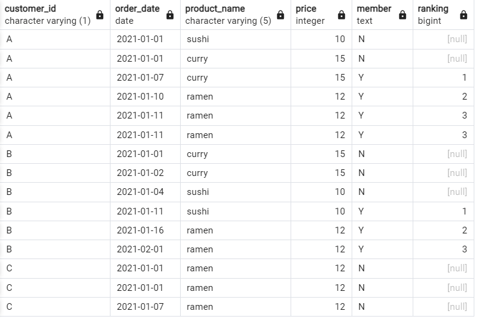

<h1>Case Study #1 - Danny's Diner</h1>

<h1>Contents</h1>
<ul>
  <li><a href="#introduction">Introduction</a></li>
  <li><a href="#problemstatement">Problem Statement</a></li>
  <li><a href="#entityrelationshipdiagram">Entity Relationship Diagram</a></li>
  <li><a href="#casestudyquestionsandsolutions">Case Study Questions & Solutions</a></li>
  <li><a href="#bonusquestionsandsolutions">Bonus Questions & Solutions</a></li>
</ul>

<h1><a name="introduction">Introduction</a></h1>
<p>In early 2021, Danny follows his passion for Japanese food and opens "Danny's Diner," a charming restaurant offering sushi, curry, and ramen. However, lacking data analysis expertise, the restaurant struggles to leverage the basic data collected during its initial months to make informed business decisions. Danny's Diner seeks assistance in using this data effectively to keep the restaurant thriving.</p>

<h1><a name="problemstatement">Problem Statement</a></h1>
<p>Danny aims to utilize customer data to gain valuable insights into their visiting patterns, spending habits, and favorite menu items. By establishing a deeper connection with his customers, he can provide a more personalized experience for his loyal patrons.

He plans to use these insights to make informed decisions about expanding the existing customer loyalty program. Additionally, Danny seeks assistance in generating basic datasets for his team to inspect the data conveniently, without requiring SQL expertise.

Due to privacy concerns, he has shared a sample of his overall customer data, hoping it will be sufficient for you to create fully functional SQL queries to address his questions.

The case study revolves around three key datasets:

- Sales
- Menu
- Members</p>

<h1><a name="entityrelationshipdiagram">Entity Relationship Diagram</a></h1>



<h1><a name="casestudyquestionsandsolutions">Case Study Questions & Solutions</a></h1>

<ol>

  <li><h5>What is the total amount each customer spent at the restaurant?</h5></li>
	
```sql
SELECT S.customer_id, SUM(M.price) AS total_amnt
FROM sales S
JOIN menu M ON S.product_id = M.product_id
GROUP BY S.customer_id
ORDER BY customer_id
```

<h6>Answer:</h6>



  <li><h5>How many days has each customer visited the restaurant?</h5></li>

```sql
SELECT customer_id, COUNT(DISTINCT order_date) AS No_Days
FROM sales
GROUP BY customer_id
```
<h6>Answer:</h6>


  <li><h5>What was the first item from the menu purchased by each customer?</h5></li>

```sql
WITH CTE AS
(SELECT S.customer_id,DENSE_RANK() OVER(PARTITION BY S.customer_id ORDER BY S.order_date)AS rn,M.product_name
FROM sales S
JOIN menu M ON S.product_id=M.product_id)

SELECT customer_id,product_name
FROM CTE
WHERE rn=1
```

<h6>Answer:</h6>


  <li><h5>What is the most purchased item on the menu and how many times was it purchased by all customers?</h5></li>

```sql
SELECT M.product_name,COUNT(S.product_id)AS most_ordered
FROM Sales S
JOIN menu M ON S.product_id=M.product_id
GROUP BY M.product_name
ORDER BY most_ordered DESC
LIMIT 1
```

<h6>Answer:</h6>



  <li><h5>Which item was the most popular for each customer?</h5></li>

```sql
WITH CTE AS
(SELECT S.customer_id,M.product_name,COUNT(M.product_id)AS order_count,DENSE_RANK() OVER(PARTITION BY S.customer_id ORDER BY COUNT(S.product_id)DESC) AS rnk
FROM sales S
JOIN menu M ON S.product_id=M.product_id
GROUP BY S.customer_id,M.product_name)

SELECT customer_id,product_name,order_count
FROM CTE
WHERE rnk=1
```

<h6>Answer:</h6>


  <li><h5>Which item was purchased first by the customer after they became a member?</h5></li>

  ```sql
  SELECT DISTINCT ON (s.customer_id)
       s.customer_id,
       m.product_name
FROM sales s
JOIN members mbr ON s.customer_id = mbr.customer_id
JOIN menu m ON s.product_id = m.product_id
WHERE s.order_date > mbr.join_date
ORDER BY s.customer_id;
```

<h6>Answer:</h6>


  <li><h5>Which item was purchased just before the customer became a member?</h5></li>

  ```sql
SELECT DISTINCT ON (s.customer_id)
		s.customer_id,
       m.product_name
FROM sales s
JOIN members mbr ON s.customer_id = mbr.customer_id
JOIN menu m ON s.product_id = m.product_id
WHERE s.order_date < mbr.join_date
ORDER BY s.customer_id;
```

<h6>Answer:</h6>


  <li><h5>What is the total items and amount spent for each member before they became a member?</h5></li>

  ```sql
SELECT S.customer_id,
	COUNT(S.product_id) AS total_item,
	SUM(M.price) AS total_amont
FROM sales S
JOIN menu M ON S.product_id=M.product_id
JOIN members ME ON S.customer_id=ME.customer_id
WHERE S.order_date<ME.join_date
GROUP BY S.customer_id
ORDER BY S.customer_id
```

<h6>Answer:</h6>


  <li><h5>If each $1 spent equates to 10 points and sushi has a 2x points multiplier - how many points would each customer have?</h5></li>

  ```sql
SELECT s.customer_id,
       SUM(CASE
               WHEN m.product_name = 'sushi' THEN price * 2
               ELSE price
           END) * 10 AS total_points
FROM sales s
JOIN menu m ON s.product_id = m.product_id
GROUP BY s.customer_id
ORDER BY s.customer_id;
```

<h6>Answer:</h6>


  <li><h5>In the first week after a customer joins the program (including their join date) they earn 2x points on all items, not just sushi - how many points do customer A and B have at the end of January?</h5></li>

  ```sql
WITH dates_cte AS (
  SELECT 
    customer_id, 
    join_date, 
    join_date + INTERVAL '6 days' AS valid_date, 
    DATE_TRUNC('month', '2021-01-31'::DATE) + INTERVAL '1 month' - INTERVAL '1 day' AS last_date
  FROM members
)

SELECT 
  s.customer_id, 
  SUM(CASE
    WHEN m.product_name = 'sushi' OR (s.order_date BETWEEN dates.join_date AND dates.valid_date) THEN 2 * 10 * m.price
    ELSE 10 * m.price END) AS points
FROM sales s
INNER JOIN dates_cte AS dates
  ON s.customer_id = dates.customer_id
  AND dates.join_date <= s.order_date
  AND s.order_date <= dates.last_date
INNER JOIN menu m
  ON s.product_id = m.product_id
GROUP BY s.customer_id
ORDER BY s.customer_id;
```

<h6>Answer:</h6>

</ol>

<h1><a name="bonusquestionsandsolutions">Bonus Questions & Solutions</a></h1>
<h5>Join All The Things</h5>

```sql
WITH customer_member_status AS (
  SELECT
    s.customer_id,
    s.order_date,
    m.product_name,
    m.price,
    CASE
      WHEN mbr.join_date <= s.order_date THEN 'Y'
      ELSE 'N'
    END AS member
  FROM sales s
  INNER JOIN menu m ON s.product_id = m.product_id
  LEFT JOIN members mbr ON s.customer_id = mbr.customer_id
)
SELECT
  customer_id,
  order_date,
  product_name,
  price,
  member
FROM customer_member_status
ORDER BY
  customer_id,
  member DESC,
  order_date;
```

<h6>Answer:</h6>


<h5>Rank All The Things</h5>
<p>Danny needs additional information about the ranking of customer products. However, he specifically requires null ranking values for non-member purchases, as he is not interested in ranking customers who are not yet part of the loyalty program.</p>

```sql
WITH customers_data AS (
    SELECT 
        sales.customer_id, 
        sales.order_date,  
        menu.product_name, 
        menu.price,
        CASE
            WHEN members.join_date > sales.order_date THEN 'N'
            WHEN members.join_date <= sales.order_date THEN 'Y'
            ELSE 'N' 
        END AS member_status
    FROM sales
    LEFT JOIN members ON sales.customer_id = members.customer_id
    INNER JOIN menu ON sales.product_id = menu.product_id
)

SELECT 
    customer_id,
    order_date, 
    product_name, 
    price,
    member_status AS member,
    CASE
        WHEN member_status = 'N' THEN NULL
        ELSE RANK() OVER (PARTITION BY customer_id, member_status ORDER BY order_date)
    END AS ranking
FROM customers_data;
```

<h6>Answer:</h6>



